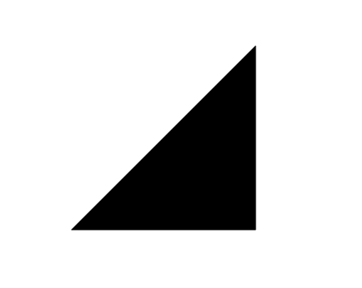
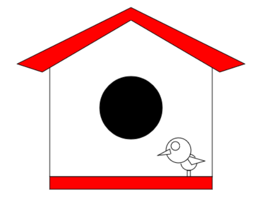

# Drawing shapes using html canvas and javascript

1. Triangle:                                                                               

                                                                           
                                                 

                                                                                       

2. Bird's Home:

